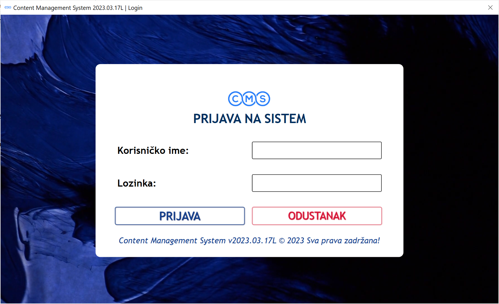
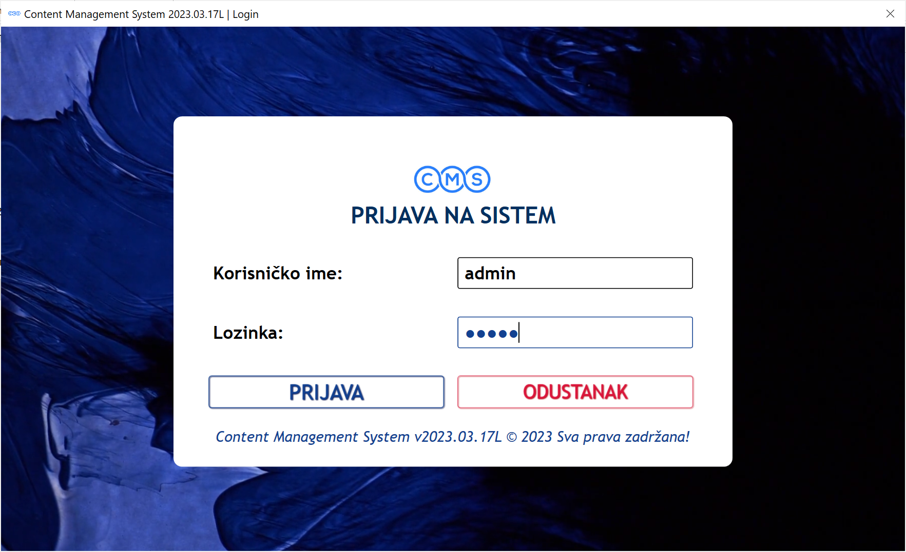
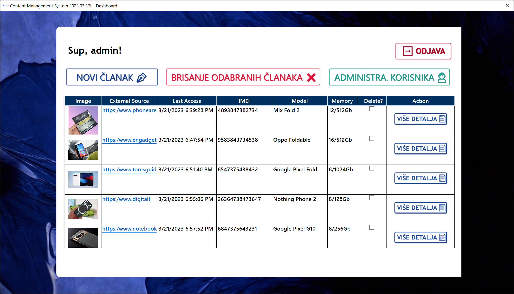
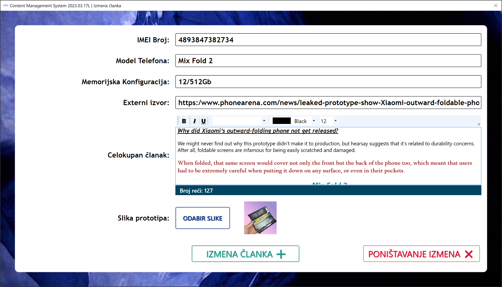
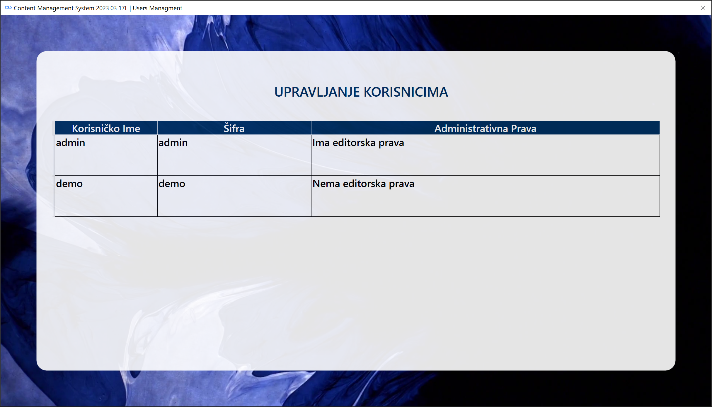
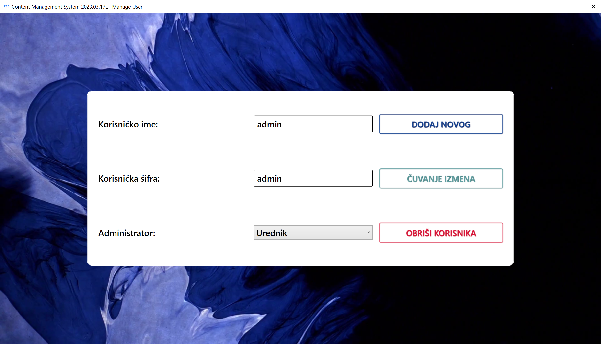
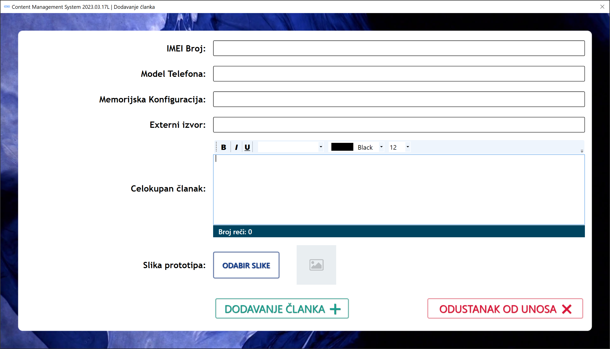

 
 <h2 align="center">Content Managment System 2023.03.17</h2>
 
Aplikacija koja predstavlja pojednostavljenu verziju sistema za upravljanje sadržajem.

  

    
    
    
    
    
     
     
     
  

  

    <a href="https://github.com/owlCoder/cms/issues/new/choose">Prijava Bug-a</a>
    ·
    <a href="https://github.com/owlCoder/cms/issues/new/choose">Nova mogućnost u aplikaciji</a>
    ·
    <a href="https://github.com/owlCoder/cms/discussions">Postavite pitanje</a>
  

   

# Mogućnosti Aplikacije

-   Dodavanje novog prototipa
-   Izmena postojećeg prototipa
-   Brisanje postojećeg prototipa
-   Rad sa RichText dokumentima   
-   Multikorisničko okruženje dodavanja/pregleda
  

 

# Korisnički Interfejs

  

  

  

  

  

  

> **Warning**
> Izgled aplikacije je podložan promeni i predstavlja trenutnu ilustraciju UI!

 

Spisak osoba koje su doprineli da projekat "CMS 2023.03.17" postane javno dostupan.

- @owlCoder    -> Danijel Jovanović

> **Note**
> Spisak ljudi koji su učestovali odnosi se na trenutak izmene README datoteke i može se razlikovati u budućnosti!

